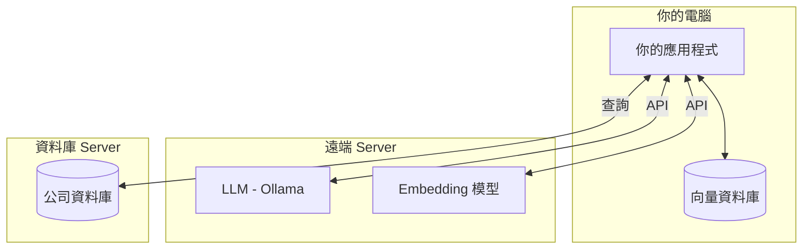
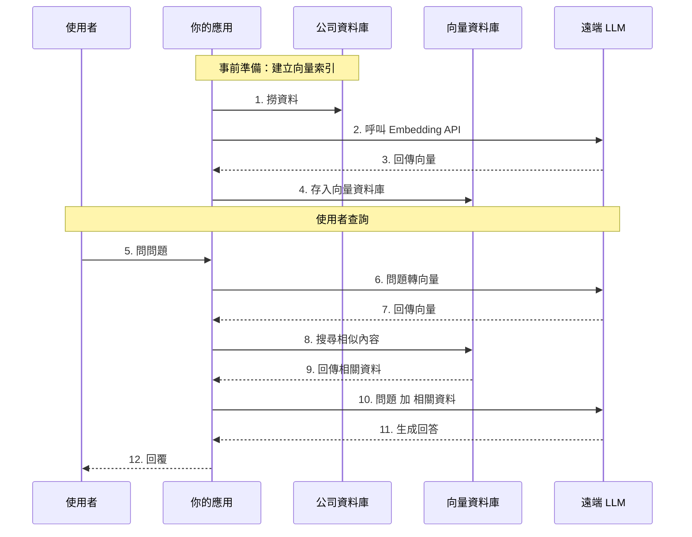
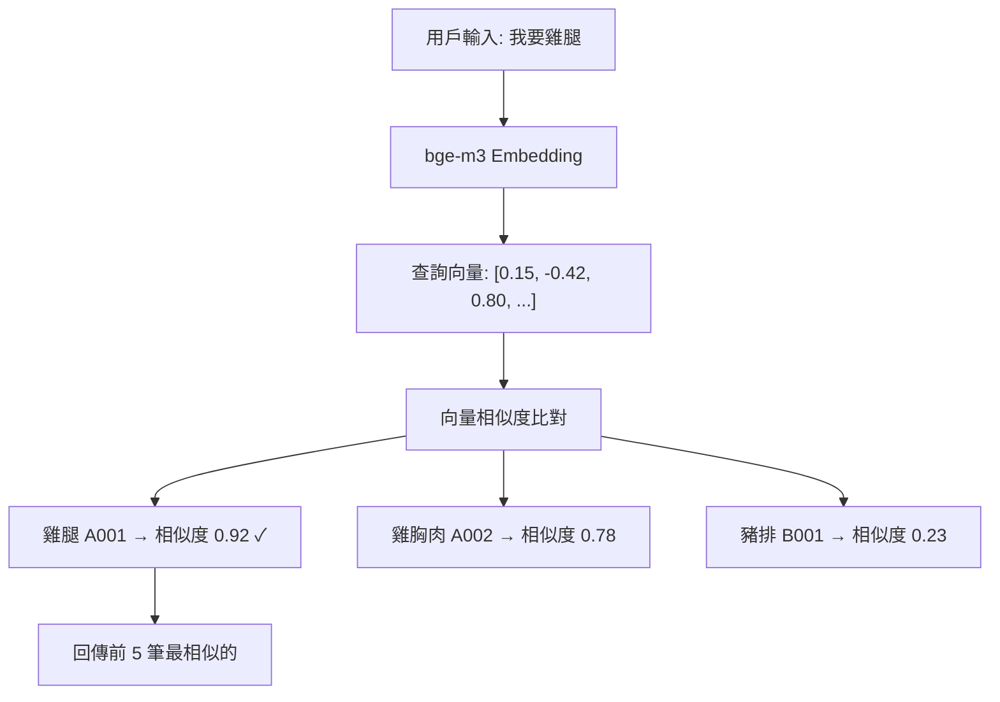
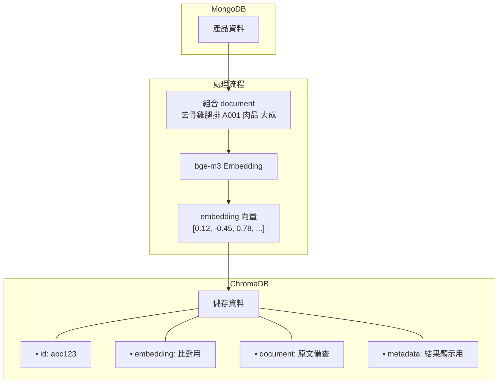
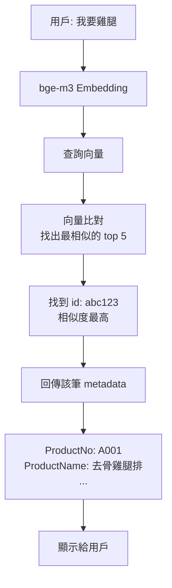

# 向量資料庫運作原理

## 系統架構



## RAG 完整流程



---

## 1. 向量資料庫怎麼存放資料

`build_index.py:47-57` 存入資料的結構：

| 欄位 | 範例 | 說明 |
|------|------|------|
| `id` | `"abc123"` | MongoDB 的 `_id`，唯一識別碼 |
| `embedding` | `[0.12, -0.45, 0.78, ...]` | 文字轉成的向量（bge-m3 是 1024 維） |
| `document` | `"雞腿 A001 肉品 大成"` | 原始文字（品名+編號+類別+品牌） |
| `metadata` | `{ProductNo, ProductName, ...}` | 額外資訊，查詢時會一起回傳 |

---

## 2. documents 與 metadatas 的差別

| | documents | metadatas |
|---|-----------|-----------|
| **格式** | 純文字字串 | 結構化字典 |
| **用途** | 給 embedding 模型看的原始文字 | 給程式用的欄位資料 |
| **可搜尋** | 是（用來產生向量） | 否（只是附帶資料） |

### 範例

假設 MongoDB 有一筆產品：

```python
{
    "_id": "abc123",
    "ProductNo": "A001",
    "ProductName": "去骨雞腿排",
    "ProductCategory": "肉品",
    "ProductBrand": "大成"
}
```

存入 ChromaDB 時：

```python
# document（build_index.py:37 組出來的）
"去骨雞腿排 A001 肉品 大成"   # ← 一個字串，拼在一起

# metadata（build_index.py:51-56）
{
    "ProductNo": "A001",
    "ProductName": "去骨雞腿排",
    "ProductCategory": "肉品",
    "ProductBrand": "大成"
}
```

### 為什麼要分開？

- **document** - 用來做語意搜尋（用戶說「我要雞腿」→ 比對 document 的向量）
- **metadata** - 用來顯示結果（找到後，從 metadata 拿出結構化資料顯示給用戶看）

如果只存 document，就沒辦法單獨取出「ProductNo」或「ProductName」，只會拿到一整串文字。

---

## 3. 搜尋怎麼比對

**比對原理**：計算兩個向量的「夾角」(Cosine Similarity)，越接近（角度越小）= 語意越相似



---

## 4. 回傳哪些資訊

`collection.query()` 回傳的結構：

```python
{
    'ids': [['abc123', 'def456', ...]],           # 產品 ID
    'distances': [[0.08, 0.22, ...]],             # 距離（越小越相似）
    'documents': [['雞腿 A001...', '雞胸肉...']],  # 原始文字
    'metadatas': [[                               # 你存的 metadata
        {
            'ProductNo': 'A001',
            'ProductName': '雞腿',
            'ProductCategory': '肉品',
            'ProductBrand': '大成'
        },
        {...}
    ]]
}
```

---

## 5. 完整流程圖

### 建立索引 (build_index.py)



### 查詢流程 (rag_query.py)



---

## 總結

**embedding 負責「找」，metadata 負責「顯示」。**
